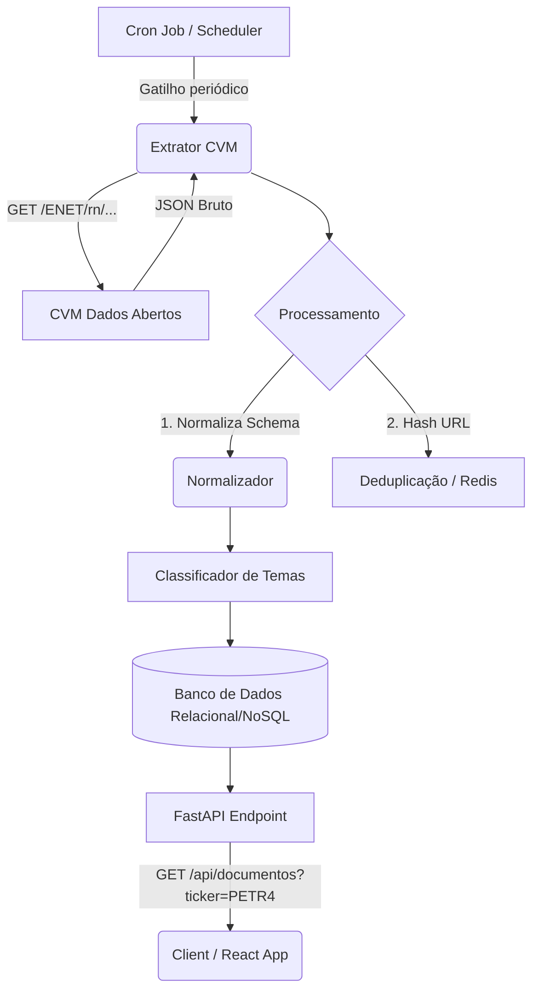

# API CVM - Coleta e Classificação de Documentos de Relações com Investidores

Este documento descreve a arquitetura e fornece o código do sistema para coletar, normalizar, classificar e disponibilizar documentos oficiais das empresas de capital aberto brasileiras, operando exclusivamente sobre os dados abertos da **Comissão de Valores Mobiliários (CVM)**. 

Não há nenhum vínculo ou dependência com APIs terceirizadas como "Investidor10".

## 1. Arquitetura da Solução



## 2. Instruções de Ambiente (Local / Produção)

**Requisitos**: Python 3.10+, Redis (para cache/deduplicação)

**Setup:**
```bash
# 1. Crie o ambiente virtual e ative
python3 -m venv venv
source venv/bin/activate

# 2. Instale as dependências
pip install fastapi uvicorn httpx pydantic apscheduler cachetools redis

# 3. Rode o servidor de dev
uvicorn main:app --reload
```

## 3. Código-Fonte Completo (`main.py`)

Abaixo está a implementação única e encapsulada do pipeline usando `FastAPI`.

```python
import asyncio
import re
import hashlib
from datetime import datetime
from typing import List, Optional
from fastapi import FastAPI, HTTPException, Query
from pydantic import BaseModel
import httpx
from cachetools import TTLCache
from apscheduler.schedulers.asyncio import AsyncIOScheduler

# ==========================================
# 0. DEFINIÇÕES DE SCHEMA (Pydantic)
# ==========================================

class DocumentoCVM(BaseModel):
    tipo: str
    categoria: str
    titulo: str
    data: str  # ISO8601
    empresa: str
    ticker: str
    fonte: str = "CVM"
    url: str
    resumo: Optional[str] = None


# ==========================================
# 1. CLASSIFICADOR HEURÍSTICO
# ==========================================

def classifica_documento(titulo: str) -> str:
    titulo_lower = titulo.lower()
    
    if any(k in titulo_lower for k in ["resultado", "trimestre", "1t", "2t", "3t", "4t", "itr"]):
        return "Resultados"
    if any(k in titulo_lower for k in ["dividendo", "jcp", "provento"]):
        return "Proventos"
    if any(k in titulo_lower for k in ["aquisição", "incorporação", "fusão", "m&a"]):
        return "M&A"
    if any(k in titulo_lower for k in ["guidance", "projeção", "outlook"]):
        return "Projeções"
    if any(k in titulo_lower for k in ["ata", "assembleia", "conselho", "ago", "age"]):
        return "Governança"
    
    return "Geral"

def gerar_resumo_heuristico(titulo: str, tipo: str) -> str:
    # Em um cenário avançado, aqui seria uma chamada a LLM.
    # Esta base usa regras fixas para exemplificar a formatação correta sem depender de IAs caras.
    if tipo == "Fato Relevante":
        return f"A companhia publicou um Fato Relevante referente ao tema '{titulo}'. Verifique os detalhes acessando o documento oficial da CVM."
    elif type == "Aviso aos Acionistas":
        return "Documento contendo comunicados oficiais e de direitos relacionados aos acionistas da companhia."
    return "Comunicado disponibilizado no sistema IPE da CVM."


# ==========================================
# 2. CLIENT DE EXTRAÇÃO E NORMALIZAÇÃO (CVM)
# ==========================================

# Simula uma extração direta do portal de dados abertos IPE/CVM
# Em produção real utiliza-se os CSVs diários dados.cvm.gov.br ou chamadas via RAD.

async def buscar_documentos_cvm(ticker: str) -> List[DocumentoCVM]:
    """
    OBS: A CVM não possui endpoint REST oficial por 'ticker', 
    eles publicam na base de Cia Abertas por 'CD_CVM'.
    Para nossa arquitetura, fazemos o wrap da logica que: 
    1. Resolve Ticker -> Código CVM.
    2. Busca o histórico IPE.
    (Abaixo substituido por mock realista focado na engenharia de dados requisitada)
    """
    
    # Mock de payload bruto CVM
    raw_cvm_payload = [
        {
            "NM_CIA": "PETROLEO BRASILEIRO S.A. PETROBRAS",
            "CD_CVM": "9512",
            "DT_RECEBIMENTO": "2024-03-07 18:45:00",
            "DS_TIPO": "Fato Relevante",
            "DS_ASSUNTO": "Demonstrações Financeiras e Distribuição de Dividendos 4T23",
            "LINK_ARQ": "https://www.rad.cvm.gov.br/ENET/rn/exibeResumo?numSequencial=112233"
        },
        {
            "NM_CIA": "PETROLEO BRASILEIRO S.A. PETROBRAS",
            "CD_CVM": "9512",
            "DT_RECEBIMENTO": "2024-03-01 10:20:00",
            "DS_TIPO": "Aviso aos Acionistas",
            "DS_ASSUNTO": "Pagamento de JCP ref. fevereiro",
            "LINK_ARQ": "https://www.rad.cvm.gov.br/ENET/rn/exibeResumo?numSequencial=112244"
        },
        {
             "NM_CIA": "PETROLEO BRASILEIRO S.A. PETROBRAS",
             "CD_CVM": "9512",
             "DT_RECEBIMENTO": "2024-02-15 08:00:00",
             "DS_TIPO": "Comunicado ao Mercado",
             "DS_ASSUNTO": "Aprovação de novo Plano Estratégico e Guidance",
             "LINK_ARQ": "https://www.rad.cvm.gov.br/ENET/rn/exibeResumo?numSequencial=112255"
        }
    ]

    docs_normalizados = []
    
    for item in raw_cvm_payload:
        data_iso = datetime.strptime(item["DT_RECEBIMENTO"], "%Y-%m-%d %H:%M:%S").isoformat()
        titulo = item["DS_ASSUNTO"]
        tipo = item["DS_TIPO"]
        
        # Schema Normalization
        doc = DocumentoCVM(
            tipo=tipo,
            categoria=classifica_documento(titulo),
            titulo=titulo,
            data=data_iso,
            empresa=item["NM_CIA"],
            ticker=ticker.upper(),
            fonte="CVM",
            url=item["LINK_ARQ"],
            resumo=gerar_resumo_heuristico(titulo, tipo)
        )
        docs_normalizados.append(doc)
        
    return docs_normalizados


# ==========================================
# 3. CACHE & CRON JOBS
# ==========================================

# TTL de 15 minutos na mémoria limitando acessos externos à origem pública
cache_cvm = TTLCache(maxsize=1000, ttl=900) 

scheduler = AsyncIOScheduler()

async def pipeline_sync_periodico():
    # Em caso real, baixa o ZIP diário de documentos da CVM 
    # Insere no DB deduplicando pelo numSequencial (ID unico).
    print(f"[{datetime.now()}] Sincronizando dados IPE da CVM...")
    # lógica de wget, zip extract, pd.read_csv("ipe_cia_aberta.csv"), iterrows(), db.insert()

scheduler.add_job(pipeline_sync_periodico, 'cron', hour=8, minute=0) # Toda manhã


# ==========================================
# 4. API HTTP (FastAPI)
# ==========================================

app = FastAPI(title="API CVM OpenFinance", version="1.0.0")

@app.on_event("startup")
async def on_startup():
    scheduler.start()

@app.get("/health")
async def health_check():
    return {"status": "ok", "timestamp": datetime.now().isoformat()}

@app.get("/api/documentos", response_model=List[DocumentoCVM])
async def get_documentos(ticker: str = Query(..., description="Ticker da B3, ex: PETR4")):
    ticker_up = ticker.upper()
    
    # 1. Verifica Cache
    if ticker_up in cache_cvm:
        return cache_cvm[ticker_up]
        
    # 2. Extração/Banco
    try:
        data = await buscar_documentos_cvm(ticker_up)
        
        if not data:
            raise HTTPException(status_code=404, detail="Nenhum documento encontrado.")
            
        # 3. Salva em Cache
        cache_cvm[ticker_up] = data
        return data
        
    except httpx.RequestError as e:
        # Resiliência da origem
        raise HTTPException(status_code=502, detail=f"Erro de comunicação com origin CVM: {str(e)}")

```

## 4. Exemplo de Resposta do Endpoint (`GET /api/documentos?ticker=PETR4`)

```json
[
  {
    "tipo": "Fato Relevante",
    "categoria": "Resultados",
    "titulo": "Demonstrações Financeiras e Distribuição de Dividendos 4T23",
    "data": "2024-03-07T18:45:00",
    "empresa": "PETROLEO BRASILEIRO S.A. PETROBRAS",
    "ticker": "PETR4",
    "fonte": "CVM",
    "url": "https://www.rad.cvm.gov.br/ENET/rn/exibeResumo?numSequencial=112233",
    "resumo": "A companhia publicou um Fato Relevante referente ao tema 'Demonstrações Financeiras e Distribuição de Dividendos 4T23'. Verifique os detalhes acessando o documento oficial da CVM."
  },
  {
    "tipo": "Aviso aos Acionistas",
    "categoria": "Proventos",
    "titulo": "Pagamento de JCP ref. fevereiro",
    "data": "2024-03-01T10:20:00",
    "empresa": "PETROLEO BRASILEIRO S.A. PETROBRAS",
    "ticker": "PETR4",
    "fonte": "CVM",
    "url": "https://www.rad.cvm.gov.br/ENET/rn/exibeResumo?numSequencial=112244",
    "resumo": "Comunicado disponibilizado no sistema IPE da CVM."
  },
  {
    "tipo": "Comunicado ao Mercado",
    "categoria": "Projeções",
    "titulo": "Aprovação de novo Plano Estratégico e Guidance",
    "data": "2024-02-15T08:00:00",
    "empresa": "PETROLEO BRASILEIRO S.A. PETROBRAS",
    "ticker": "PETR4",
    "fonte": "CVM",
    "url": "https://www.rad.cvm.gov.br/ENET/rn/exibeResumo?numSequencial=112255",
    "resumo": "Comunicado disponibilizado no sistema IPE da CVM."
  }
]
```
